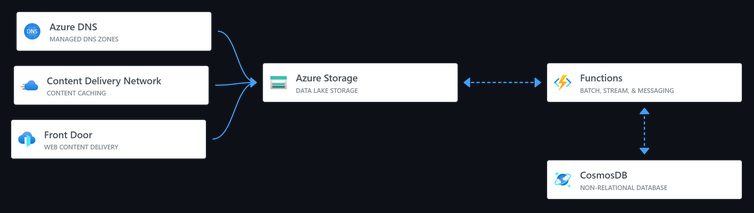

# Connor Crist's Azure Resume
Huge shoutout to Gwyneth Pen-Siguenza, her resources allowed me to get started on this project, and at the moment this readme looks quite similar to the one she created. However, soon I will add features to this project that make this project different from what she has created. 

This is my resume as a part of the Cloud Resume Challenge built on Azure. So far it is a static website hosted on Azure Storage, with a visitor counter built on Azure Functions using an HTTP trigger. The website is built using HTML, CSS, and JavaScript. The visitor counter is built using .NET and Azure Functions. I created this using this [video](https://www.youtube.com/watch?v=ieYrBWmkfno&feature=youtu.be), however some modifications were necessary in configuring the project to work currently, as the video 3 years ago. 

- Versioning of the Microsoft.Azure.Functions.Worker.Extensions.CosmosDB, Microsoft.Azure.WebJobs.Extensions.CosmosDB, and Microsoft.NET.Sdk.Functions were necessary in order for the application to deploy to Azure correctly
- I am currently working on an updated version that uses dotnet 8.0 framework, however I am running into deployment issues at the moment! 

The current structure looks like the above diagram, however I will be updating this as functionality is added, at this point this image comes directly from this [repository](https://github.com/madebygps/azure-resume/tree/main) by Gwyneth Pena-Siguenza who also made the original tutorial.

## Demo
The website can be found [here](https://resume-connorcrist.azureedge.net/)

## Pre-requisites
- Azure account and resource group
- Azure Cosmos DB
- Azure Function Core Tools
- Azure Functions Extension
- Azure Storage Extension

## Structure
- Frontend/: Contains the website
    - main.js: this folder contains the visitor counter code
- api/: Contians the dotnet API deployed on Azure Functions
    - Counter.cs: Contains the visitor counter code

## Frontend resources
The front-end is a static website that I filled my information in on, it is made of HTML, CSS, and Javascript. I can take no credit in it's design, it comes from this [template](https://styleshout.com/free-templates/ceevee/).

## Backend resources
The back-end is an HTTP Triggered Azure Function with Cosmos DB input and output binding. The function is triggered when the website is loaded, it then gets the current value of visitors that have been to the website from CosmosDB, adds 1 to it, then updates that value within CosmosDB.

## TO DO
- Add testing resources to this project, as well as CI/CD
- Update to .NET 8
- Introduce additional security features
- Add additional functions
- Add event hub 
